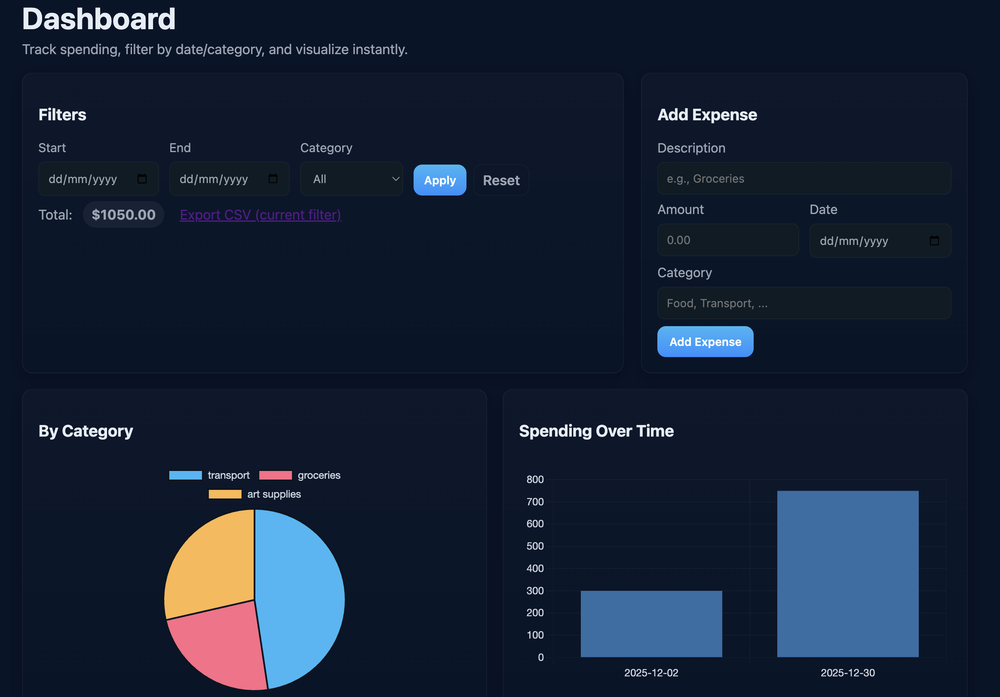
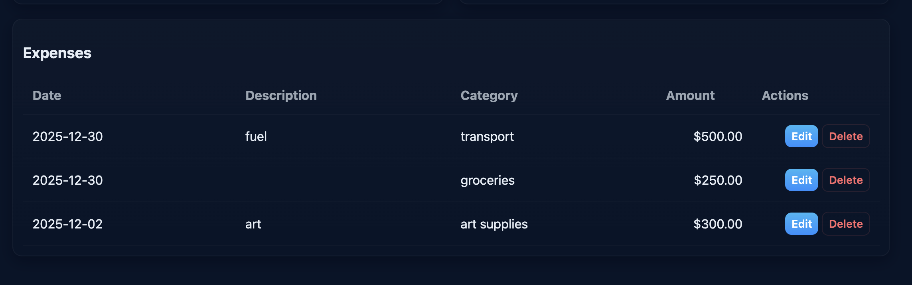

# Expense Tracker – Flask Web Application

A full-stack expense tracking web application built with **Flask** and **SQLite**.  
The application allows users to record, manage, and analyze daily expenses through a clean, user-friendly interface.

This project demonstrates end-to-end web development fundamentals including backend routing, database operations, templating, and static asset management.

---

## Features

- Add expenses with amount, category, description, and date
- View all expenses in a structured dashboard
- Edit existing expense entries
- Delete expenses
- Visual representation of spending using charts
- Persistent data storage using SQLite

---

## Tech Stack

- **Backend:** Python, Flask  
- **Frontend:** HTML, CSS, Jinja2  
- **Database:** SQLite  
- **Version Control:** Git, GitHub  

---

## Project Structure

expense-tracker/
├── app.py
├── expenses.db
├── requirements.txt
├── templates/
│ ├── base.html
│ ├── index.html
│ └── edits.html
├── static/
│ └── style.css
├── screenshots/
│ ├── dashboard.png
│ └── add-expense.png
└── README.md

## How to Run the Project Locally

1. Clone the repository:
   ```bash
   git clone https://github.com/Joshitasunkari31/Flash_expensetracker.git
   cd Flash_expensetracker

2. Create and activate a virtual environment:
    python -m venv venv
    source venv/bin/activate   # Windows: venv\Scripts\activate

3. Install dependencies:
    pip install -r requirements.txt

4. Run the application:
    python app.py

5. Open your browser and navigate to:
    http://127.0.0.1:5000/


## Screenshots

### Dashboard



### Add Expense


